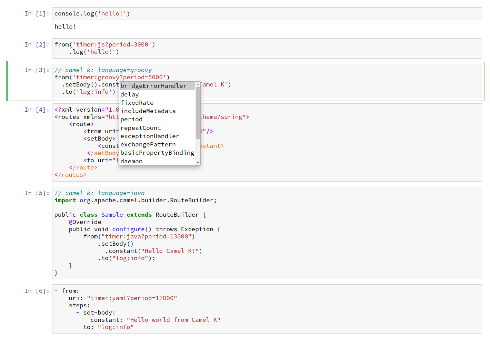

# ICamel &mdash; Jupyter kernel for Apache Camel

This kernel enables you to run [Apache Camel](https://camel.apache.org/) routes in Jupyter notebooks.



## Table of Contents

* [Prerequisites](#prerequisites)
* [Supported Camel route languages](#supported-camel-route-languages)
* [Supported Camel components](#supported-camel-components)
* [Installing](#installing)
* [Build from source](#build-from-source)

## Prerequisites

- [Jupyter](https://jupyter.org/install)
- Java >= 11

## Supported Camel route languages

All [route languages](https://camel.apache.org/camel-k/latest/languages/languages.html) supported by [Camel K](https://camel.apache.org/camel-k/latest/index.html) except Kotlin are supported by ICamel. See the following links to learn how to write a Camel route with each language.

- [Groovy](https://camel.apache.org/camel-k/latest/languages/groovy.html)
- [JavaScript](https://camel.apache.org/camel-k/latest/languages/javascript.html)
- [Java](https://camel.apache.org/camel-k/latest/languages/java.html)
- [XML](https://camel.apache.org/camel-k/latest/languages/xml.html)
- [YAML](https://camel.apache.org/camel-k/latest/languages/yaml.html)

The opinionated default language for ICamel is JavaScript. To use other languages than JavaScript or XML, prepend a comment line `// language=...` at the beginning of each cell.

- Groovy
  
  ```groovy
  // language=groovy
  from('timer:tick')
      .process { it.in.body = 'Hello Camel K!' }
      .to('log:info')
  ```
  
- Java
  
  ```java
  // language=java
  import org.apache.camel.builder.RouteBuilder;
  
  public class Sample extends RouteBuilder {
      @Override
      public void configure() throws Exception {
          from("timer:tick")
              .setBody()
                .constant("Hello Camel K!")
              .to("log:info");
      }
  }
  ```

- YAML

  ```yaml
  - from:
    uri: "timer:tick"
    steps:
      - set-body:
          constant: "Hello Camel K!"
      - to: "log:info"
  ```

## Supported Camel components

At this moment, only components that are included in `camel-core` are supported. Automatic downloading of Camel component dependencies will be implemented in a future version.

## Installing

Download the latest `icamel-0.x-runner.jar` from https://github.com/tadayosi/icamel/releases.

```console
curl -LO https://github.com/tadayosi/icamel/releases/download/icamel-0.4.0/icamel-0.4.0-runner.jar
```

Then create a directory `camel` under the Jupyter kernels directory:

    mkdir -p `jupyter --data-dir`/kernels/camel

and copy `icamel-0.x-runner.jar` into the directory:

    cp icamel-0.x-runner.jar `jupyter --data-dir`/kernels/camel/

Finally, create a file `kernel.json` with the following content under the `camel` kernel directory. Note `<your-camel-kernel-dir>` needs to be substituted with the actual path (e.g. `/home/<username>/.local/share/jupyter/kernels/camel`):

```json
{
  "argv": [
    "java",
    "-jar",
    "<your-camel-kernel-dir>/icamel-0.x-runner.jar",
    "{connection_file}"
  ],
  "display_name": "Camel",
  "language": "camel",
  "interrupt_mode": "message",
  "env": {
  }
}
```

See the example JSON file [kernel.json](./kernel.json) for more configuration options.

## Build from source

Run the following command:

    mvn clean install
